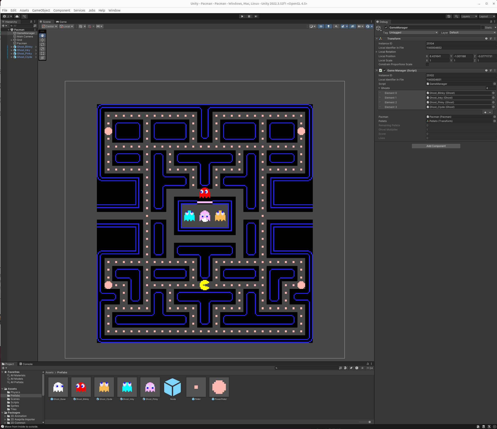

# Project: 2D Pacman

Pacman in Unity 3D and updated forv Unity version 2022.3.52f1.

- **Figure 1:** 2D Pacman Developed in Unity3D

## Overview

Pac-Man is a classic arcade game that can be recreated in Unity using the 2D rendering pipeline. 
The game consists of a maze, Pac-Main character, ghosts, pellets, and power pellets. 
The main objective is for Pac-Man to eat all the pellets while avoiding the ghosts.

<!-- ## Contents -->

## Pacman Software Architecture

The game architecture is built around several key components:

- 1. **GameManager:** Controls the overall game state and logic.

- 2. **Maze:** Utilizes Unity's Tilemap system for efficient level design.

- 3. **Pac-Man:** Player-controlled character with movement and collision detection.

- 4. **Ghosts:** Normally AI-controlled, but simplified controlled enemies with various behavior states.

- 5. **Pellets:** Collectible items scattered throughout the maze.

## Pac-Man

Pac-Man's implementation involves the following key aspects:

- 1. **Movement:** Utilizes a Node-based system for navigation.

- 2. **Animation:** Implements sprite animation for Pac-Man's mouth movement

- 3. **Collision Detection:** Handles interactions with pellets, power pellets, and ghosts.

- 4. **Input System:** Processes player input for directional movement

## Ghosts

Ghost behavior is iplemented using conditional logic with four main states (NOTE: later could be refactored to leverage a state machine approach):

- 1. **Scatter:** Ghosts move to predetermined corners of the maze.

- 2. **Chase:** Ghosts pursue Pac-Man using different targeting strategies.

- 3. **Frightened:** Ghosts become vulnerable and flee from Pac-Man.

- 4. **Home:** Ghosts return to their starting position after being eaten.

## Dependencies for Running Demo

To run the Pac-Man demo, you'll need:

- 1. Unity 2022.3.52f1 or later (for 2D Tilemap Extras package).

- 2. C# development environment (e.g. Visual Studio, VS Code, etc).

- 3. Pac-Man sprite assets (can be created or found online, the Pac-Man youtube video tutorial in resources section provides them)

## How to Run Demo

1. Clone the project repository or download the source code.

2. Open the project in Unity 2022.3.52f1 or later. (NOTE: if you do later version, you might need to update code to be compatible with that version).

3. Ensure all required assets are imported (should come with github cloned project).

4. Open the main scene (in our case, its named "Pacman")

5. Press the Play button in the Unity editor to start the game.

## Conclusion and Future Works on AI

This Pac-Man implementation in Unity provides a solid foundation for the classic game.
Future improvements could focus on enhancing ghost AI:

- 1. **Machine Learning:** Implement reinforcement learning for ghost behavior.

- 2. **Dynamic Difficulty:** Adjust ghost behavior based on player performance.

- 3. **Predictive Movement:** Enhance ghost pathfinding to anticipate Pac-Man's moves.

- 4. **Collaborative Behavior:** Implement communication between ghosts for coordinated attacks.

By expanding on these AI concepts, the Pac-Man game could offer more challenging and diverse gameplay experiences, keeping players engaged with evolving ghost strategies.

## Resources

Check out our Resources section where you can learn more information about how we learned to build this Pac-Man classic game in Unity by watching Zigurous's "How to make Pacman in Unity (Complete Tutorial)" youtube video. We also provided some related github repos with Zigurous's github, but also we included a blog post from Jason Tu who designed and developed Pac-Man in Unreal Engine 5.

How to make Pacman in Unity (Complete Tutorial): https://youtu.be/TKt_VlMn_aA?si=uOksYZJYi3I8TAxg

- zigurous/unity-pacman-tutorial: https://github.com/zigurous/unity-pacman-tutorial

Rethinking Pac-Man in Unreal Engine 5, Jason Tu, Sept 28, 2023: https://jasont.co/chomp/

With help on generating Pac-Man project text information above in each section, check out how we leveraged Perplexity AI to quickly and concisely write out the content: https://www.perplexity.ai/search/you-are-a-video-game-software-bptTF1cdRDagFyCm7r93Vg
